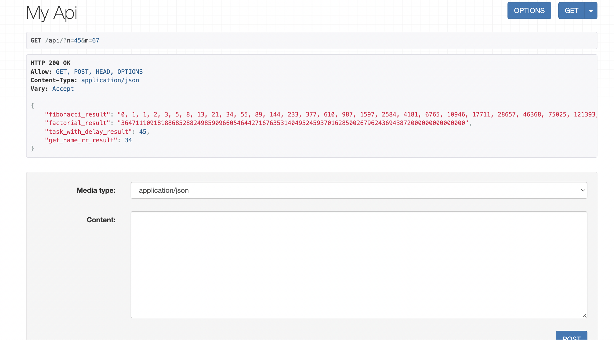

# Django-Docker-Compose-Celery-Redis-PostgreSQL



This project demonstrates a setup for running a Django application with Docker Compose, Celery for background tasks, Redis as a message broker, and PostgreSQL as the database.

## Getting Started

Follow these steps to set up and run the project:

### Prerequisites

- Python 3.x
- Docker
- Docker Compose
- Celery
- Postgres

### Installation

1. Clone the repository to your local machine:

   ```bash
   git clone https://github.com/runitrupam/Django-Docker-Compose-Celery-Redis-PostgreSQL.git
   cd Django-Docker-Compose-Celery-Redis-PostgreSQL
   ```

2. Create a virtual environment and activate it:

   ```bash
   python3 -m venv venv
   source venv/bin/activate
   ```

3. Install the project dependencies:

   ```bash
   pip install -r requirements.txt
   ```

### Usage

1. Start the Docker containers:

   ```bash
   docker-compose up
   ```

   - To run the containers in detached mode, use `docker-compose up -d`.

2. Build the Docker images (if needed):

   ```bash
   docker-compose build
   ```

3. To run just the Django application:

   ```bash
   docker-compose run django
   ```

4. Access the Django admin interface:

   - Visit `http://localhost:8000/admin/` in your web browser.
   - You can create a superuser using `python manage.py createsuperuser` inside the Django container.

5. To access the Django container's shell:

   ```bash
   docker-compose exec django bash
   ```

6. Perform GET requests to the API with query parameters `n` and `m`:

   Example request:

   ```bash
   http "http://localhost:8000/api/?n=45&m=67"
   ```

## API Endpoints

### GET `/api/?n=45&m=67`

- **HTTP Response**: 200 OK
- **Allowed Methods**: GET, POST, HEAD, OPTIONS
- **Content-Type**: application/json

This endpoint returns a JSON response with the results of various tasks:

```json
{
    "fibonacci_result": "0, 1, 1, 2, 3, 5, 8, 13, ...",
    "factorial_result": "36471110918188685288...",
    "task_with_delay_result": "Task with a runit 10-second delay completed...",
    "get_name_rr_result": "Task with get_name_rr comp."
}
```


### Celery Tasks

The project includes Celery tasks that you can use as examples or expand upon. To register new tasks with Celery, remember to rebuild the containers using `docker-compose build` since tasks need to be registered with Celery.

## `celery.py`

This module configures Celery for running background tasks. Here's a breakdown of what it does:

```python
import os
from celery import Celery

os.environ.setdefault("DJANGO_SETTINGS_MODULE", "core.settings")

app = Celery("core")

app.config_from_object("django.conf:settings", namespace="CELERY")

app.autodiscover_tasks()
```

## Docker Compose Configuration

In the Docker Compose YML file, we have configured the following:

- `volumes`:
  - .:/usr/src/app/
  - This allows any change done to the files of the directory to trigger the server to restart.

## Important Note

- When creating new functions and using decorators like `@shared_task` or `@app.task`, it's crucial to run `docker-compose build` again because the tasks need to be registered with Celery.
- If you encounter import errors like `ImportError: cannot import name 'fibonacci'`, consider checking your import statements and make sure the tasks are properly registered with Celery.
- When making changes to Docker Compose configuration, especially related to services like Celery, it's recommended to stop and remove the existing containers and then start fresh containers using `docker-compose up`.
- Consider using Jenkins or a similar Continuous Integration/Continuous Deployment (CI/CD) pipeline to minimize downtime when deploying updates to your application, including changes to Docker containers and Docker Compose configurations.


## Troubleshooting: ImportError when Using Celery Tasks

While using Celery tasks, you may encounter import errors like the one below:

```python
# ImportError: cannot import name 'fibonacci' from 'app.tasks'
# (/usr/src/app/app/tasks.py)
```

This error occurs because the task cannot be imported correctly. Here's how I resolved it:

1. Initially, I decorated the task function like this:

   ```python
   @shared_task  # will find the task of Celery all over your Celery
   @app.task  # will fetch the task belonging to the instance of Celery only 
   def fibonacci(n):
       if n <= 0:
           return "Invalid input"
   ```

2. However, I encountered the ImportError mentioned above.

3. To fix this issue, I updated the import statement to explicitly import the Celery app instance from the `core.celery` module:

   ```python
   from core.celery import app
   ```

4. Previously, I was mistakenly trying to import `app` from the top-level `celery` module:

   ```python
   # Incorrect import
   from celery import app
   ```

5. Even after fixing the import statement, I faced a `celery.exceptions.NotRegistered` error.

6. To resolve the `NotRegistered` error, I ensured that I had properly registered the task with Celery and that any changes to tasks or decorators were reflected by rebuilding the Docker containers using `docker-compose build`.

This troubleshooting step helped me successfully import and register the Celery task, resolving the import and `NotRegistered` issues.


### Here's a step-by-step explanation of the provided Docker Compose configuration:

```yaml
version: "3.8"

services:
    # Django Service
    django:
        build: .
        container_name: django
        command: >
            bash -c "python manage.py makemigrations &&
                     python manage.py migrate &&
                     python manage.py runserver 0.0.0.0:8000"
        volumes:
            - .:/usr/src/app/
        ports:
            - "8000:8000"
        environment:
            - DEBUG=1
            - DJANGO_ALLOWED_HOSTS=localhost 127.0.0.1 [::1]
            - CELERY_BROKER=redis://redis:6379/0
            - CELERY_BACKEND=redis://redis:6379/0
        depends_on:
            - pgdb
            - redis

    # Celery Service
    celery:
        build: .
        command: celery -A core worker -l INFO
        volumes:
            - .:/usr/src/app
        environment:
            - DEBUG=1
            - DJANGO_ALLOWED_HOSTS=localhost 127.0.0.1 [::1]
            - CELERY_BROKER=redis://redis:6379/0
            - CELERY_BACKEND=redis://redis:6379/0
        depends_on:
            - django
            - redis

    # PostgreSQL Database Service
    pgdb:
        image: postgres
        container_name: pgdb
        environment:
            - POSTGRES_DB=postgres
            - POSTGRES_USER=postgres
            - POSTGRES_PASSWORD=postgres
        volumes:
            - pgdata:/var/lib/postgresql/data/

    # Redis Service
    redis:
        image: "redis:alpine"

# Define a named volume for PostgreSQL data storage
volumes:
    pgdata:
```

Here's a step-by-step explanation of each part:

1. **`version: "3.8"`**: This specifies the version of Docker Compose being used.

2. **`services`**: This section defines the various services that make up your application.

   - **`django`**: This is the Django service.
     - `build`: It builds the Docker image using the current directory (where the Dockerfile is located).
     - `container_name`: Sets the name of the container to "django".
     - `command`: Runs a series of commands when the container starts. It performs migrations and runs the Django development server.
     - `volumes`: Mounts the current directory (where your Django code resides) into the container at `/usr/src/app/`. This allows you to develop with live code reloading.
     - `ports`: Maps port 8000 on your local machine to port 8000 inside the container.
     - `environment`: Sets environment variables like DEBUG, DJANGO_ALLOWED_HOSTS, CELERY_BROKER, and CELERY_BACKEND.
     - `depends_on`: Specifies that this service depends on the `pgdb` (PostgreSQL) and `redis` services.

   - **`celery`**: This is the Celery service.
     - `build`: Similar to the Django service, it builds the Docker image.
     - `command`: Runs the Celery worker with the Django app specified by `-A core`. Logs are set to INFO level.
     - `volumes`: Mounts the current directory into the container.
     - `environment`: Sets environment variables.
     - `depends_on`: Specifies dependencies on the `django` and `redis` services.

   - **`pgdb`**: This is the PostgreSQL database service.
     - `image`: Pulls the PostgreSQL Docker image from the official repository.
     - `container_name`: Sets the name of the container to "pgdb".
     - `environment`: Sets environment variables for the PostgreSQL database, including the database name, username, and password.
     - `volumes`: Creates a named volume called "pgdata" to store PostgreSQL data files.

   - **`redis`**: This is the Redis service.
     - `image`: Pulls the Redis Docker image from the official repository.

3. **`volumes`**: This section defines named volumes used by services.

   - `pgdata`: This is a named volume created for storing PostgreSQL data.

This Docker Compose configuration sets up your Django application with PostgreSQL, Celery for background tasks, and Redis as a message broker. It's a comprehensive setup for development and testing of your Django project in a containerized environment.